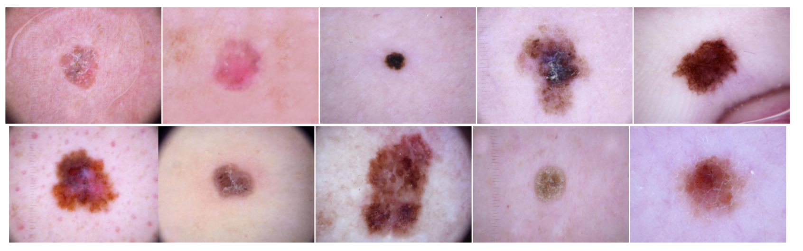
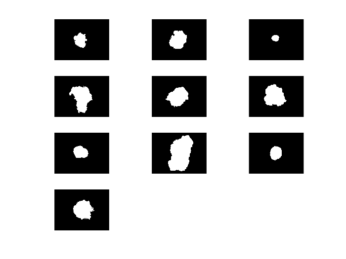
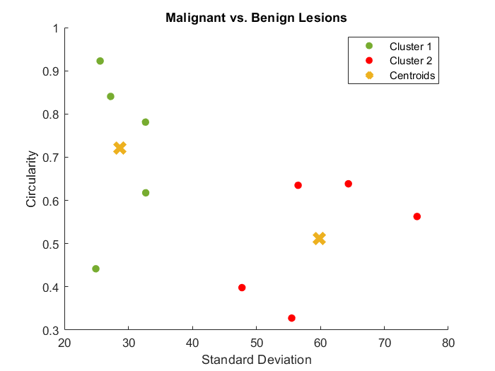

**Project Title:** Principles of Biosignals and Biomedical Imaging - MATLAB Image Processing of Dermoscopic Images

**Authors:** Armando Goncalves (100290), Patrcia Marques (100357)  
**Contact:** armandogoncalves@tecnico.ulisboa.pt, patriciasmarques@tecnico.ulisboa.pt  

**Illustrations:**
- 
- 
- 

**Abstract:**  
This project utilizes MATLAB to classify 10 skin lesion images as benign or malignant based on their standard deviation and circularity. By combining image processing and cluster analysis, the project aims to assist in identifying melanomas and distinguishing them from keratosis-like lesions. The study showcases the importance of computer-aided analysis in dermatology and demonstrates MATLAB's potential as a tool for image analysis and classification.

**Introduction:**  
Skin cancer is a prevalent form of cancer globally, often caused by UV radiation exposure. Melanoma, the deadliest form, presents challenges in differentiation from benign lesions. The ABCDE rule guides identification, emphasizing asymmetry, border irregularity, color variation, diameter, and evolution. This project analyzes dermoscopic images to classify lesions based on these criteria.

**State-of-the-Art:**  
Dermoscopy aids in skin lesion examination, with computer-aided diagnosis (CAD) systems enhancing accuracy. Deep learning models, including convolutional neural networks (CNNs) and recurrent neural networks (RNNs), assist in identifying features associated with melanoma, such as irregular borders and color distribution.

**Methods:**  
MATLAB is used to preprocess images, extract features, and perform k-means clustering for classification. Grayscale conversion, denoising, thresholding, and morphological operations are applied to isolate lesions. Circular and standard deviation features are computed for each image, facilitating clustering and classification.

**Results and Discussion:**  
The project successfully clusters and classifies lesions as benign or malignant based on extracted features. Clusters are visualized, and images are categorized accordingly. Validation confirms the accuracy of clustering and classification, though further tests like biopsies are necessary for definitive diagnoses.

**Conclusions:**  
MATLAB proves effective in analyzing skin lesion images, demonstrating potential for image analysis and classification tasks. Future work may involve incorporating additional features and advanced machine learning techniques to enhance accuracy.

**Note:**  
For further details and implementation code, refer to the project documentation and MATLAB scripts.
